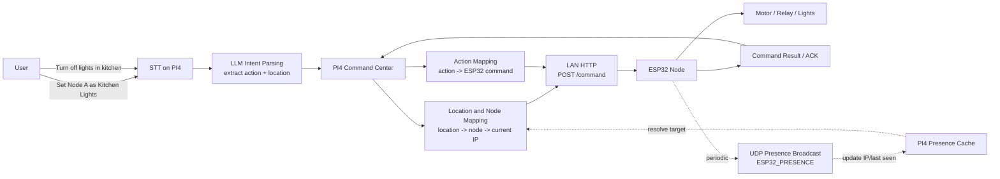

# Embedded Software Design - System Overview

This repository contains two cooperating components:
- a Raspberry Pi 4 controller node (decision brain),
- and ESP32 motor node firmware (action executor).

## Documentation map

- `README.md` (this file): system architecture and end-to-end interaction flow.
- `PI4_command_center/README.md`: PI4 server setup, APIs, discovery, mapping, and runtime state.
- `ESP32_motors/README.md`: ESP32 firmware behavior, endpoints, and device-side execution details.

## 1) Raspberry Pi 4 Node (Controller)

The Raspberry Pi 4 is the local intelligence layer that:
- runs local speech-to-text (STT),
- can optionally run local LLM and vision models,
- decides what physical action to trigger based on input,
- sends control signals to the corresponding ESP32 node.

### Responsibilities
- **Input processing**: audio (STT), optional camera/image, optional text commands.
- **Decision logic**: map interpreted intent to an action key.
- **Routing/configuration**: maintain a configuration of:
  - which ESP32 corresponds to which action/switch,
  - how to address each ESP32 (for example by ID/topic/address).
- **Dispatch**: send trigger signals to the selected ESP32 reliably.

## 2) ESP32 Motor Node (Executor)

The ESP32 motor firmware:
- supports configurable behavior and pin settings,
- receives trigger signals from the Raspberry Pi 4,
- executes motor movement for the requested action,
- returns the motor to neutral state after action,
- enters low-power mode while waiting for the next trigger.

### Responsibilities
- **Configuration**: motor pin, neutral angle, action angles/timing, power mode.
- **Action execution**: move servo/motor according to received command.
- **Safe reset**: return to neutral state after each action.
- **Energy saving**: reduce power draw when idle (for example detach servo/sleep).

## High-Level Flow

1. User input is captured on Raspberry Pi 4 (voice/image/text).
2. Local models infer intent and resolve an action.
3. Pi checks action-to-ESP32 mapping.
4. Pi sends signal to target ESP32.
5. ESP32 executes movement, returns to neutral, then idles in low-power mode.

## PI4 <-> ESP32 Communication Flow (LAN + UDP)

The PI4 Command Center communicates with ESP32 nodes over local network:
- **LAN/HTTP** for commands (`POST /command`)
- **UDP presence broadcast** for discovery/IP updates (`ESP32_PRESENCE` to PI4)

### Expected future intent flow

1. User says: `Set Node A as Kitchen Lights`
   - STT transcribes voice.
   - LLM classifies this as a **mapping intent**.
   - PI4 stores/updates `node A -> kitchen` mapping.

2. User says: `Turn off lights in kitchen`
   - STT transcribes voice.
   - LLM extracts `location=kitchen`, `action=turn_off`.
   - PI4 resolves `kitchen -> node -> current IP`.
   - PI4 maps `turn_off -> command` and sends to ESP32 over LAN.
   - ESP32 executes the hardware behavior and returns status.

### ESP32 action behavior

After receiving a command, ESP32 should:
1. parse command JSON,
2. execute mapped actuator behavior (motor/relay/light action),
3. return success/failure response,
4. continue UDP presence broadcast so PI4 can rediscover after IP changes.
